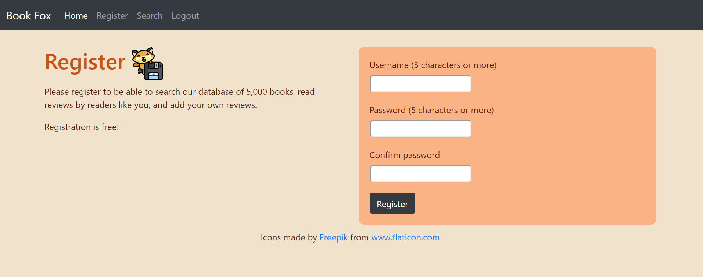
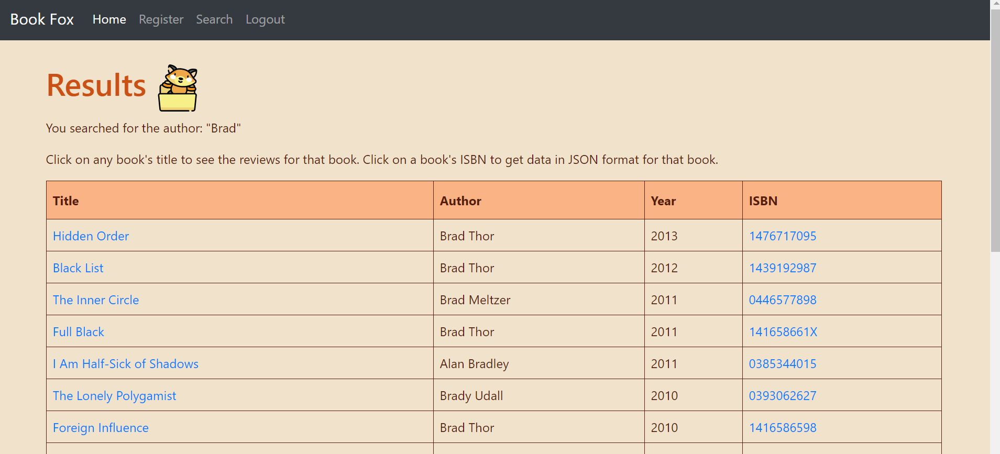

# bookFox

## Website description
Book Fox Once is a Flask web application where you can search for books, leave reviews for individual books, and see the reviews made by other people. The app also uses a third-party API by Goodreads, another book review website, to pull in ratings from a broader audience. Finally, users are be able to query for book details and book reviews programmatically via the website’s API.

## Interface
| Homepage view             | Register view |
:-------------------------:|:-------------------------:
  |  

After registering, you can query the database for book information based on ISBN, title, or author. In the results page clicking on the book's title displays the book review information. The book's ISBN is linked to an internal API which returns a JSON of the book id, isbn, average score, and number of reviews made.

| Search view             | Results view |
:-------------------------:|:-------------------------:
  |  

| Book Information view             |
:-------------------------:
  | 

